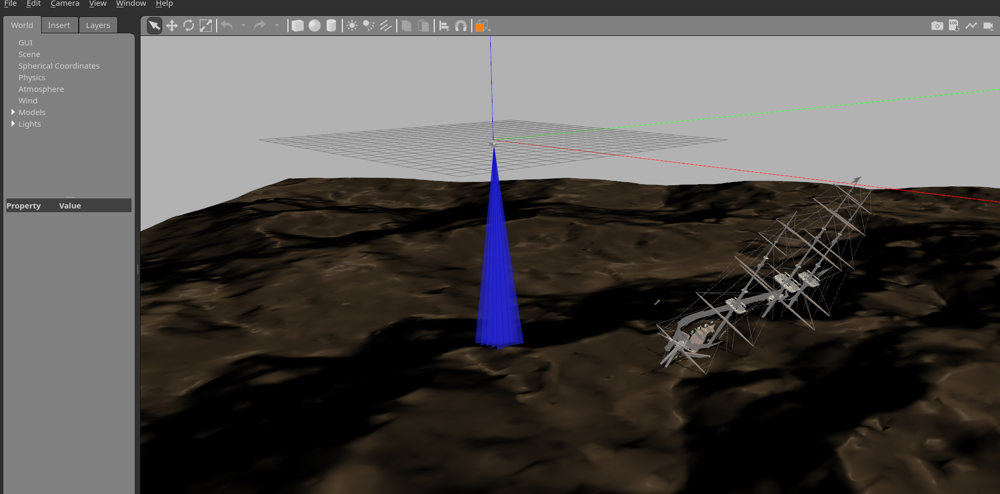

# BlueROV2 Exercise

The goal of this exercise is to provide a more realistic scenario of using ROS with underwater vehicles. We are going to simulate the BlueROV2 in a Gazebo environment and control it using ROS. The BlueROV2 is also equipped with a depth sensor. The depth sensor is used to measure the depth of the BlueROV2.




## Exercise

The exercise is divided into two parts. The first part is a tutorial that will guide you through the process of setting up the BlueROV2 simulated environment and running a simple ROS node. The second part is an exercise that will require you to write a ROS node that will control the BlueROV2.

## Sostware requirements

- ubuntu 22.04
- Docker
- Git

## How to install the programs needed for the exercise directly on your computer

It is recommended to use the docker installation method described in the next section. If however you want to install the programs directly on your computer, then follow these instructions:

1. Install S.I.T.L. (Software In The Loop). This is a simulatator for running ArduSub. Follow the instructions in the following link:https://ardupilot.org/dev/docs/building-setup-linux.html#building-setup-linux

2. Install ROS 2 Iron. Follow the instructions in the following link: https://docs.ros.org/en/iron/Installation/Ubuntu-Install-Debians.html

3. Install Gazebo 11. Follow the instructions in the following link: http://gazebosim.org/tutorials?tut=install_ubuntu&cat=install

   Note: This exercise uses gazebo 11 which is depricated. In the future I will update the exercise to use gazebo Ignition.

4. Install freebuoyancy_gazebo_plugin. Follow the instructions in the following link: https://github.com/bluerobotics/freebuoyancy_gazebo#install

5. Install mavros. Follow the instructions in the following link (Binary Installation is perfectly fine): https://docs.px4.io/main/en/ros/mavros_installation.html

7. Install ardupilot_gazebo. Follow the instructions in the following link: https://github.com/patrickelectric/ardupilot_gazebo/tree/add_link#usage-

8. Install bluerov2 Gazebo model and plugins. Follow the instructions in the following link:

Detailed instructions at https://discuss.bluerobotics.com/t/setting-up-a-simulation-environment/2892/2?page=2


## How to run the package using Docker

1. Clone the repository
   ```
   git clone https://github.com/vilmamuco/ros2-exercises.git
   cd ros2-exercises/src/exercise3/
   ```
2. Run the following command in the exercise3 directory

   ```
   docker build --build-arg UID=$(id -u) --build-arg GID=$(id -g) -t ros2_course .
   ```
3. Open a new terminal and run the following command
   If you are using an nvidia GPU run the following command:

   ```
   docker run \
       --name=ros2_ws\
       -it --rm \
       -v /tmp/.X11-unix:/tmp/.X11-unix \
       -v /mnt/wslg:/mnt/wslg \
       -e DISPLAY \
       -e WAYLAND_DISPLAY \
       -e XDG_RUNTIME_DIR \
       -e PULSE_SERVER \
       -v $(pwd):/home/ubuntu/ros2_ws \
       --gpus all \
       ros2_course
   ```
       
   If using **AMD GPU** replace the `--gpus all` flag with this `--device=/dev/dri`:

   ```
   docker run \
       --name=ros2_ws\
       -it --rm \
       -v /tmp/.X11-unix:/tmp/.X11-unix \
       -v /mnt/wslg:/mnt/wslg \
       -e DISPLAY \
       -e WAYLAND_DISPLAY \
       -e XDG_RUNTIME_DIR \
       -e PULSE_SERVER \
       -v $(pwd):/home/ubuntu/ros2_ws \
       --device=/dev/dri \
       ros2_course
   ```

## Running the exercise inside the Docker container

Once the container is running, you will need to run four components inside this single container: Gazebo, ArduSub, Mavros and the ROS2 node controlling the robot.
There are two different ways of doing so: using a launch file or manually.

### How to run everything in two terminals, using a launch file


1. Run gazebo
   Keep the terminal running the docker container open, and execute these commands within:
   ```
   cd /home/docker/bluerov_ros_playground/
   source /home/docker/freebuoyancy_gazebo/gazebo.sh
   source gazebo.sh
   gazebo ./worlds/underwater.world
   ```
2. Attach a second shell to the container
   Open a new terminal window and start a new shell inside the same docker container:
   ```
   docker exec -it ros2_ws bash
   ```
3. Run the BlueROV2, ArduSub and Mavros2
   In the new shell, run the prepared launch file:
   ```
   cd /home/ubuntu/ros2_ws/
   source /opt/ros/iron/setup.bash
   source install/setup.bash
   colcon build --symlink-install --packages-select exercise3
   ros2 launch ./exercise3/launch/bringup_blueROV2.py
   ```

## How to run everything in four terminals, manually

If you want finer control over which parts are running at any given moment, you can run each component in a separate terminal.
As above, you want to execute these all inside the same container, so you will need to attach a new shell to the running container for each of these steps using `docker exec -it ros2_ws bash`.

1. Launch Gazebo:

   ```
   cd /home/docker/bluerov_ros_playground/
   source /home/docker/freebuoyancy_gazebo/gazebo.sh
   source gazebo.sh
   gazebo ./worlds/underwater.world
   ```

2. Launch ArduSub:

   ```
   ~/ardupilot/Tools/autotest/sim_vehicle.py -f gazebo-bluerov2 -L RATBeach --console -v ArduSub
   ```

3. Launch Mavros:

   ```
   # source iron underlay
   source /opt/ros/iron/setup.bash
   ros2 launch mavros apm.launch     fcu_url:=udp://0.0.0.0:14550@:14549/?ids=255,240     gcs_url:=udp://@
   ```

4. Launch the ROS2 node controlling the robot:

   ```
   # cd to ubuntu home directory
   cd /home/ubuntu/ros2_ws/
   # source iron underlay
   source /opt/ros/iron/setup.bash
   # source workspace
   source install/setup.bash

   # build the workspace
   colcon build --packages-select exercise3

   # run the node
   ros2 run exercise3 bluerov
   ```